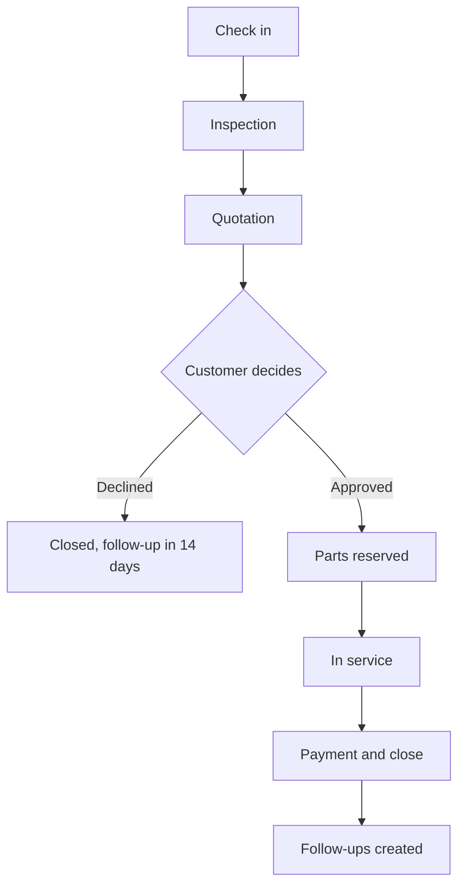

# NEXAUTO

Workshop operations app for auto repair shops. It covers vehicle check-in, inspection, quotation, service, payment, parts inventory, purchasing, customer follow-ups and role-based access, in one page that works on phone and laptop.

**Live demo:** https://yapseng98.github.io/NEXAUTO/

> This is a working demo. All data is stored in your browser, so each visitor gets their own copy. Use **Settings → Reset demo data** to start fresh.

## Features

| Module | What you can do |
|---|---|
| Sign in | Each user has their own username and password, with a lockout after five failed attempts and a session that can be remembered or not |
| Dashboard | Revenue and profit today, workshop pipeline, follow-ups due, low stock alerts, quick actions |
| Orders | Check in vehicles, inspection, build and send quotes, a printable customer quotation, approve or decline, extra-work approval, payment, shared job notes |
| Inventory | Parts with photos, on-hand, reserved and available stock, stock adjustments, purchase orders, receiving, suppliers, stock history |
| Customers | Customer profiles, multiple vehicles, service history, lifetime spend, follow-ups |
| Insights | Jobs that have stalled and why, stock to reorder with suggested quantities, customers worth calling, and an optional Ask-anything panel |
| Reports | Revenue over 7 days, 30 days or 6 months, gross profit and margin, average ticket, quote approval rate, parts vs labor, completed jobs and revenue per technician |
| Settings | Five tabs — General (workshop name, brand colour, reset), Users (staff and sign-in policy), Roles (what each role may do), Lists (inspection checklist, payment methods, part categories, adjustment reasons, customer tiers), Timing (follow-ups, stalled-job thresholds, stock planning) |

## Signing in

Each user signs in with their own username and password. What you see depends on
that user's role. The demo accounts are listed on the login screen, and clicking
one fills the form:

| Role | Username | Password |
|---|---|---|
| Owner | `alex.tan` | `owner123` |
| Manager | `joanne.lim` | `manager123` |
| Service advisor | `priya.nair` | `advisor123` |
| Technician | `marcus.lee` | `tech123` |
| Technician | `daniel.koh` | `tech123` |

Owners add users and set their credentials in **Settings → Users**. Sessions last
12 hours, and are kept after closing the tab only if you tick **Keep me signed
in**. Five wrong passwords lock that username for a minute.

## Roles

| Action | Owner | Manager | Advisor | Technician |
|---|---|---|---|---|
| Revenue, profit, margin | ✓ | ✓ | – | – |
| Selling prices | ✓ | ✓ | ✓ | – |
| Cost prices | ✓ | ✓ | – | – |
| Orders visible | All | All | All | Own jobs |
| Check in a vehicle | ✓ | ✓ | ✓ | ✓ |
| Add parts and work to a quote | ✓ | ✓ | ✓ | ✓ |
| Put a price on a line, discount, send quote | ✓ | ✓ | ✓ | – |
| Inspection, mark work done | ✓ | ✓ | ✓ | ✓ |
| Read and write job notes | ✓ | ✓ | ✓ | ✓ |
| Reassign job, edit mileage and complaint | ✓ | ✓ | ✓ | ✓ |
| Discount | Any | Any | Up to 10% | – |
| Take payment | ✓ | ✓ | ✓ | – |
| Purchase orders, receive stock | ✓ | ✓ | ✓ | – |
| Add parts, change prices | ✓ | ✓ | – | – |
| Manage users | ✓ | – | – | – |
| Edit the shop's lists and timings | ✓ | ✓ | – | – |
| Rename the workshop, sign-in policy | ✓ | – | – | – |
| Open the quotation document | ✓ | ✓ | ✓ | As a job sheet, no prices |

**This table is the default, not a rule.** An owner changes any of it in
**Settings → Roles** by ticking a box — want technicians to see prices, or
advisors to stop taking payment? Tick it and it applies immediately. The owner
row is fixed at everything so nobody can lock themselves out.

Full details: [docs/ROLES.md](docs/ROLES.md)

## Work order process



Full details: [docs/PROCESS.md](docs/PROCESS.md)

## Demo script (5 minutes)

1. Sign in as **alex.tan / owner123** (Owner), then open **Orders → WO-1047** (the BMW).
2. Start the inspection, mark all 10 items, and set one to **Problem**. Then finish the inspection.
3. In **Quote and items**, click **Add to quote** on the finding, add a part, and send the quote.
4. Click **Approved**. Parts are now reserved (check **Inventory**).
5. Add another part. It's flagged **Needs approval** and blocks payment until you approve it.
6. Mark the work done, then take payment. Stock is deducted and follow-ups are created.
7. **Sign out**, then sign in as **priya.nair / advisor123** (Advisor). Profit is hidden and discounts are capped at 10%.
8. Sign out and sign in as **marcus.lee / tech123** (Technician). You only see your own jobs, with no prices.

## Project structure

```
index.html            The whole app: HTML, CSS and JavaScript in one file
docs/
  DATA_MODEL.md       Tables, fields, relationships and data rules
  PROCESS.md          Work order lifecycle, stage gates, stock flow, follow-ups
  ROLES.md            Permission matrix and access rules
  ARCHITECTURE.md     Current demo design and production target
  SECURITY.md         Security review of the demo, with severities
  SUPABASE_PLAN.md    Migration plan: schema, RLS policies, auth, phases
  TEST_REPORT.md      Results of the 437 automated checks
tests/
  suite.js            Automated end-to-end test suite
package.json          Test script
```

## Run the tests

```bash
npm install
npm test
```

The suite loads `index.html` in a simulated browser, signs in through the real login form, and clicks through every process as each role. It ends with `TOTAL: 437 passed, 0 failed`.

## Making it your own

Nothing about the workshop is baked into the code. An owner or manager can change
all of this in **Settings**, and it takes effect immediately:

| Tab | What you control |
|---|---|
| General | The workshop's name (sign-in page, sidebar, browser tab) and the brand colour every other shade is derived from |
| Users | Who works here, their role and credentials; and how long a session lasts before it expires |
| Roles | What each role is allowed to do, as a tick-box matrix |
| Lists | The inspection checklist, payment methods, part categories, stock adjustment reasons and customer tiers |
| Timing | When follow-ups are due, how many days a job can sit before it is flagged amber then red, and the window the reorder suggestions are calculated over |

Jobs copy the inspection checklist when they are created, so editing the list
never rewrites a job already under way.

## Ask-anything panel (optional)

**Insights** works with no setup: stalled jobs, reorder quantities and customer
analysis are all computed by the app from its own records. No key, no network, no
cost.

If you also want to ask questions in your own words, connect an Anthropic API key
under **Insights → Connect a key**. It is stored in that browser only and billed
to you. What gets sent is scoped to your role — a technician's request carries
only their own jobs and no money fields at all. Don't use a shared production key;
see [docs/SECURITY.md](docs/SECURITY.md) M5.

## Change the brand colour

Use **Settings → App colour** in the app, or change the default in `index.html`:

```css
--green:#0E7C3A;
```

Every other shade (hover states, light tints, dark mode) is calculated from this one value.

## Known limits of the demo

The short version: **the login screen is a UI, not a security control.** Data,
permission rules and the password check all live in the visitor's browser, which
the visitor controls. Specifically:

- **Permissions run in the browser only.** Hidden prices are hidden with CSS, so
  they are still present in the page and readable in devtools by any role. This
  is verified, not theoretical — see [docs/SECURITY.md](docs/SECURITY.md).
- **Sign-in can be bypassed** by anyone willing to edit browser storage, and the
  password digest is a demo placeholder, not a password hash.
- **Data lives in the browser**, so nothing is shared between devices or staff.
- **No invoice numbering, GST, deposits or partial payments yet.**
- **The 6 months of history is generated, not real** — it is built from a fixed seed so every visitor sees the same workshop. It is internally consistent (payments match totals, stock movements match jobs), but it describes no actual business.

Everything in that list is fixed by moving the data and the rules to a server.
[docs/SUPABASE_PLAN.md](docs/SUPABASE_PLAN.md) is the plan for doing that.

## Roadmap

1. **Phase 0, now:** SRI hashes on CDN scripts, a CSP, and a build flag for the demo credentials
2. Supabase backend: schema, Row Level Security per role, real auth ([plan](docs/SUPABASE_PLAN.md))
3. Atomic stock and payment operations, plus an append-only audit log
4. Billing: invoice numbers, GST, deposits, partial payments, PDF invoices
5. Customer quote approval link over WhatsApp or SMS
6. Inspection photos, and automatic follow-up reminders
