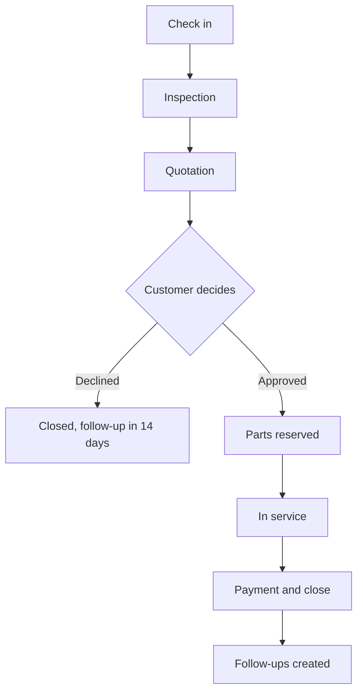

# NEXAUTO

Workshop operations app for auto repair shops. It covers vehicle check-in, inspection, quotation, service, payment, parts inventory, purchasing, customer follow-ups and role-based access, in one page that works on phone and laptop.

**Live demo:** https://yapseng98.github.io/NEXAUTO/

> This is a working demo. All data is stored in your browser, so each visitor gets their own copy. Use **Settings → Reset demo data** to start fresh.

## Features

| Module | What you can do |
|---|---|
| Dashboard | Revenue and profit today, workshop pipeline, follow-ups due, low stock alerts, quick actions |
| Orders | Check in vehicles, 10-point inspection, build and send quotes, approve or decline, extra-work approval, payment |
| Inventory | Parts with on-hand, reserved and available stock, stock adjustments, purchase orders, receiving, suppliers, stock history |
| Customers | Customer profiles, multiple vehicles, service history, lifetime spend, follow-ups |
| Reports | 7-day revenue, average ticket, quote approval rate, parts vs labor, jobs per technician |
| Settings | Brand colour (Castrol green by default), user management, reset demo data |

## Roles

Sign in as any user from the dropdown at the top right. What you see depends on that user's role.

| Action | Owner | Manager | Advisor | Technician |
|---|---|---|---|---|
| Revenue, profit, margin | ✓ | ✓ | – | – |
| Selling prices | ✓ | ✓ | ✓ | – |
| Cost prices | ✓ | ✓ | – | – |
| Orders visible | All | All | All | Own jobs |
| Check in, build quote | ✓ | ✓ | ✓ | – |
| Inspection, mark work done | ✓ | ✓ | ✓ | ✓ |
| Discount | Any | Any | Up to 10% | – |
| Take payment | ✓ | ✓ | ✓ | – |
| Purchase orders, receive stock | ✓ | ✓ | ✓ | – |
| Add parts, change prices | ✓ | ✓ | – | – |
| Manage users | ✓ | – | – | – |

Full details: [docs/ROLES.md](docs/ROLES.md)

## Work order process



Full details: [docs/PROCESS.md](docs/PROCESS.md)

## Demo script (5 minutes)

1. Signed in as **Alex Tan (Owner)**, open **Orders → WO-1047** (the BMW).
2. Start the inspection, mark all 10 items, and set one to **Problem**. Then finish the inspection.
3. In **Quote and items**, click **Add to quote** on the finding, add a part, and send the quote.
4. Click **Approved**. Parts are now reserved (check **Inventory**).
5. Add another part. It's flagged **Needs approval** and blocks payment until you approve it.
6. Mark the work done, then take payment. Stock is deducted and follow-ups are created.
7. Sign in as **Priya Nair (Advisor)**. Profit is hidden and discounts are capped at 10%.
8. Sign in as **Marcus Lee (Technician)**. You only see your own jobs, with no prices.

## Project structure

```
index.html            The whole app: HTML, CSS and JavaScript in one file
docs/
  DATA_MODEL.md       Tables, fields, relationships and data rules
  PROCESS.md          Work order lifecycle, stage gates, stock flow, follow-ups
  ROLES.md            Permission matrix and access rules
  ARCHITECTURE.md     Current demo design and production target
  TEST_REPORT.md      Results of the 113 automated checks
tests/
  suite.js            Automated end-to-end test suite
package.json          Test script
```

## Run the tests

```bash
npm install
npm test
```

The suite loads `index.html` in a simulated browser and clicks through every process as each role. It ends with `TOTAL: 113 passed, 0 failed`.

## Change the brand colour

Use **Settings → App colour** in the app, or change the default in `index.html`:

```css
--green:#0E7C3A;
```

Every other shade (hover states, light tints, dark mode) is calculated from this one value.

## Known limits of the demo

- **Permissions run in the browser only.** A technical user could still read hidden prices in the page code. Production needs server-side checks (see [docs/ARCHITECTURE.md](docs/ARCHITECTURE.md)).
- **Data lives in the browser**, so nothing is shared between devices or staff.
- **No invoice numbering, GST, deposits or partial payments yet.**
- **Some report history is sample data** (the previous 6 days of revenue and the monthly job baselines).

## Roadmap

1. Backend API with login and server-side permissions
2. Shared database (PostgreSQL) with `shop_id` on every table for multi-branch use
3. Billing: invoice numbers, GST, deposits, partial payments, PDF invoices
4. Customer quote approval link over WhatsApp or SMS
5. Inspection photos
6. Automatic reminders for follow-ups
