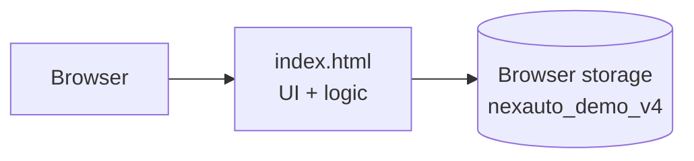
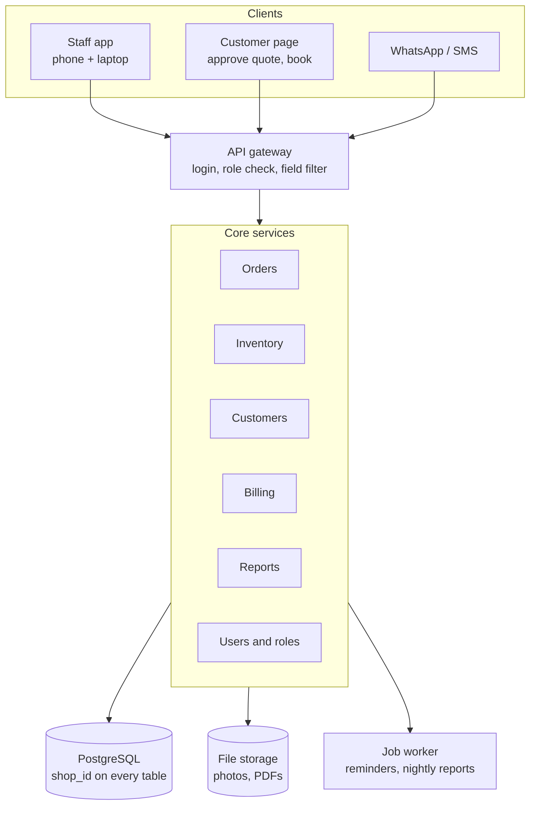

# Architecture

## Current demo

- A single self-contained HTML file, hosted on GitHub Pages.
- Rendering uses plain JavaScript string templates, with no framework.
- Actions go through one event handler, keyed on `data-action` attributes.
- Role gating uses `data-cost`, `data-price`, `data-revenue`, `data-purchase`, `data-staff` and `data-edit` attributes, which are hidden by CSS based on flags set on `<html>`.
- Charts come from Chart.js, loaded from cdnjs.

### Code map (`index.html`)

| Section | Contents |
|---|---|
| Constants | `STAGES`, `PERMS`, `INSPECTION_TEMPLATE`, `THEMES`, `NAV` |
| `seed()` | Demo data |
| Storage | `save()`, versioned load |
| Helpers | `can()`, `me()`, `totals()`, `avail()`, `reserve()`, `move()`, `log()` |
| Views | `renderDashboard`, `renderOrders`, `renderInventory`, `renderCustomers`, `renderReports`, `renderSettings` |
| Order panel | `renderOrderPanel`, `orderOverview`, `orderInspection`, `orderItems`, `orderActions` |
| Actions | `doStartInsp`, `doFinishInsp`, `doSendQuote`, `doApprove`, `doApproveExtra`, `doDecline`, `doWorkDone` |
| Modals | Check-in, customer, vehicle, part, labor, payment, stock adjust, PO, supplier, user |
| Events | Click, change and input delegation |

## Production target

### Priorities for going live

1. **Server-side permissions.** Filter rows and strip cost, profit and revenue fields before responding.
2. **Transactional stock reservation.** Wrap approval in a database transaction with row locks on parts.
3. **Data model changes.** A separate Vehicle table, `shop_id`, and Invoice with multiple payments.
4. **Billing.** Invoice numbering, GST, deposits, partial payments and PDFs.
