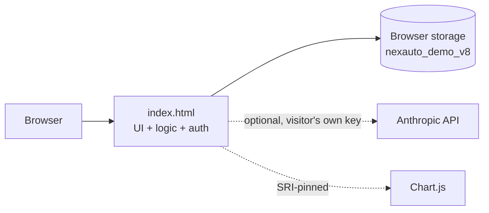
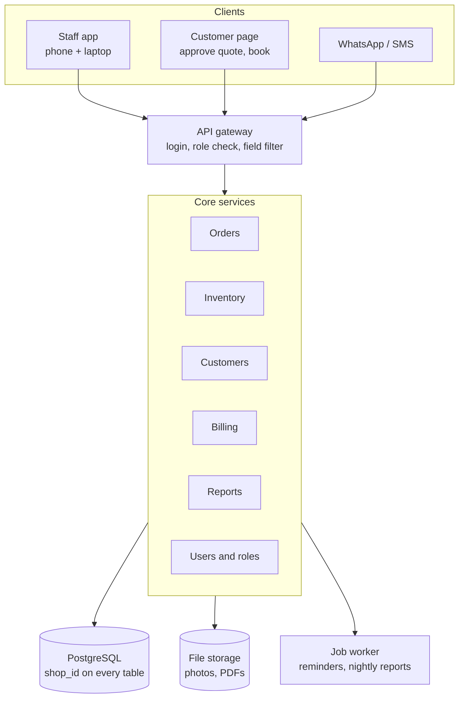

# Architecture

## Current demo

- A single self-contained HTML file, hosted on GitHub Pages. No build step, no
  dependencies at runtime beyond one pinned CDN script.
- Rendering is plain JavaScript string templates. No framework, no virtual DOM —
  every view re-renders its whole container from `DB`.
- Actions go through one document-level click handler keyed on `data-action`.
  Change and input events have their own delegated handlers.
- Role gating sets `data-can-*` flags on `<html>`; CSS hides elements marked
  `data-cost`, `data-price`, `data-revenue`, `data-purchase`, `data-staff`,
  `data-edit`, `data-checkin`, `data-config` and `data-suppliers`. **This hides, it does not
  withhold** — see [SECURITY.md](SECURITY.md) C1.
- Everything a shop can configure lives in `DB.settings`, so the same code drives
  a different workshop's lists, timings, permissions and name.
- **Layer order matters and is not obvious.** The sign-in screen is `z-index:60`,
  modals `70`, toasts `80`, the job panel `31`. A modal below the sign-in screen
  is open, focusable and invisible — which happened, and which no jsdom test can
  see, because jsdom does not paint.
- **Source order matters too.** The stylesheet is one long block with no
  cascade layers, so a rule only wins over an equally specific one by coming
  later. A media query adds no specificity — so the phone touch-target block
  sits at the very end, after `.icon-btn` and `.link-btn`. Put it where the
  other `max-width:767px` rules are and it silently does nothing.

### Why it is built this way

The constraint is a static host with no server. That rules out sessions,
server-rendered pages and any secret the app itself holds. What remains is a
single document that owns its own state, which is why `DB` is one object, why
saving is one `JSON.stringify`, and why every render is a full redraw of a
container rather than a diff. At this size that is simpler and fast enough; it
is also why the app stops being viable the moment more than one person needs to
see the same data. The backend that fixes that is in
[SUPABASE_PLAN.md](SUPABASE_PLAN.md).

### Code map (`index.html`)

| Section | Contents |
|---|---|
| Constants | `STAGES`, `BASE_PERMS`, `PERM_DEFS`, `DEFAULT_LISTS`, `LIST_DEFS`, `DEFAULT_TIMINGS`, `DEFAULT_SERVICES`, `DEFAULT_MONEY`, `THEMES`, `NAV`, `ICON` |
| Credentials | `digest()`, `setPassword()`, `checkPassword()` — demo-grade, see SECURITY.md H1 |
| `seed()` / `buildHistory()` | Demo data, including six months of deterministic history |
| Storage | `save()`, versioned load, `KEY` / `DB.v` |
| Session | `readSession()`, `writeSession()`, lockout counters |
| First run | `blankShop()`, `modalSetupShop()` — a workshop that is not the demo, created from the sign-in page |
| Settings | `listOf()`, `timing()`, `appName()`, `checklist()`, `perms()`, `services()`, `moneyCfg()`, `taxRate()`, `shopField()` — every shop-configurable value, including the role matrix and the labour price list |
| Helpers | `can()`, `me()`, `isMine()`, `totals()`, `avail()`, `reserve()`, `move()`, `log()`, `answersFinding()`, `isSettled()`, `owedOrders()` |
| Insights engine | `jobStatus()`, `attentionList()`, `owedCardHTML()`, `reorderPlan()`, `customerStats()` |
| Views | `renderDashboard`, `renderOrders`, `renderInventory`, `renderCustomers`, `renderReports`, `renderInsights`, `renderSettings` |
| Order panel | `renderOrderPanel`, `orderOverview`, `orderInspection`, `orderItems`, `orderNotes`, `orderActions` |
| Quote document | `quoteDocHTML()`, `previewQuote()`, `openDoc()` — priced for advisors, a job sheet for technicians |
| AI panel | `aiContext()`, `askClaude()` — off unless the visitor supplies a key |
| Actions | `doStartInsp`, `doFinishInsp`, `doSendQuote`, `doApprove`, `doApproveExtra`, `doDecline`, `doWorkDone` |
| Modals | Check-in, edit job, customer, vehicle, part, labor, price item, payment, stock adjust, PO, supplier, service, shop details, money rules, user, list item, timings, app name, API key |
| Events | Click, change, input and keydown delegation |

### Storage layout

| Key | Holds | Survives |
|---|---|---|
| `nexauto_demo_v8` | The entire database: staff, customers, orders, parts, movements, settings | Until the seed version changes |
| `nexauto_session` | `{userId, at, remember}` — in `localStorage` if "keep me signed in", else `sessionStorage` | 12 hours by default, configurable |
| `nexauto_lockouts` | Failed sign-in counters per username | Until cleared or expired |
| `nexauto_ai_key` | The visitor's own Anthropic key, if they added one | Until disconnected |

**Bump `KEY` and `DB.v` together whenever the seed gains a field.** The app
reseeds only when the version differs, so leaving it alone means returning
visitors silently keep an older shape — which happened once already and is
recorded in [TEST_REPORT.md](TEST_REPORT.md).

### Two traps in the test suite

- **Every check builds a jsdom window, and nothing closed them.** They stayed
  alive with their timers, so the suite's memory grew with the suite and Node
  died of heap exhaustion at around 600 checks. `T()` now closes any window a
  check opened; windows built at section scope are shared by later checks, so
  they sit below a watermark and survive. Raising `--max-old-space-size` alone
  does not fix this — it only moves the cliff.
- **The suite must not repeat the storage key.** It reads `KEY` out of
  `index.html`. Writing `nexauto_demo_v7` into `suite.js` meant a seed bump broke
  every test at once, for a reason that looked nothing like the cause.

## Production target

### Priorities for going live

1. **Server-side permissions.** Filter rows and strip cost, profit and revenue
   fields before responding. The AI panel already does this client-side and is
   the shape to copy.
2. **Transactional stock reservation.** Wrap approval in a database transaction
   with row locks on parts.
3. **Data model changes.** A separate Vehicle table, `shop_id`, and Invoice with
   multiple payments — the `settled` flag on a single payment is the demo-sized
   version of accounts receivable, and a real one needs part-payments and an
   allocation table.
4. **Billing.** Invoice numbering, GST, deposits, partial payments and PDFs.
5. **An API key that is not in the browser.** An Edge Function holding one key
   replaces the bring-your-own-key AI panel.
