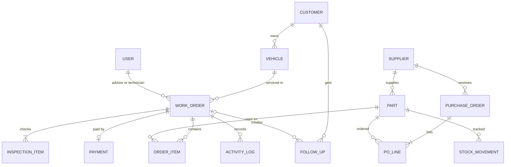

# Data model

## Entity relationship diagram

## Tables

### User
| Field | Type | Notes |
|---|---|---|
| id | string, PK | `s1` |
| name | string | Unique among active users |
| role | enum | `owner`, `manager`, `advisor`, `technician` |
| active | boolean | Users are deactivated, never deleted |

### Customer
| Field | Type | Notes |
|---|---|---|
| id | string, PK | `c1` |
| name | string | |
| phone | string, unique | Used to detect duplicates |
| tier | enum | `Standard`, `Silver`, `Gold` |
| vehicles | Vehicle[] | Nested in the demo. Its own table in production |

### Vehicle
| Field | Type | Notes |
|---|---|---|
| id | string, PK | `v1` |
| customer_id | FK → Customer | |
| plate | string, unique | Stored in uppercase |
| model | string | Make, model and year |

### Work order
| Field | Type | Notes |
|---|---|---|
| id | string, PK | `WO-1048`, sequential from `nextWO` |
| customer_id | FK → Customer | |
| vehicle_id | FK → Vehicle | |
| advisor_id | FK → User | |
| technician_id | FK → User | Must be an active technician |
| stage | enum | `reception`, `pre-inspection`, `quotation`, `in-service`, `completed`, `declined` |
| quote_status | enum | `draft`, `sent`, `approved`, `rejected` |
| mileage | int | Can't be lower than the vehicle's last recorded mileage |
| complaint | string | |
| discount | money | ≤ subtotal. Advisors ≤ 10% |
| work_done | boolean | |
| created_at | datetime | |
| inspection | InspectionItem[10] | |
| items | OrderItem[] | |
| payment | Payment or null | |
| log | ActivityLog[] | |

### Inspection item
| Field | Type | Notes |
|---|---|---|
| name | string | One of 10 fixed checklist items |
| status | enum | `unchecked`, `good`, `attention`, `problem` |
| note | string | |

### Order item
| Field | Type | Notes |
|---|---|---|
| id | string, PK | |
| type | enum | `part`, `labor` |
| sku | FK → Part | Parts only |
| name | string | |
| qty | int | ≥ 1 |
| price | money | **Copied** from the part when added |
| cost | money | **Copied** from the part when added |
| approved | boolean | False until the customer approves. Extra work added in service starts as false |

### Payment
| Field | Type | Notes |
|---|---|---|
| amount | money | Total at the time of payment |
| method | enum | `Card`, `Cash`, `PayNow`, `Bank transfer` |
| paid_at | datetime | |

### Activity log
| Field | Type | Notes |
|---|---|---|
| t | datetime | |
| x | string | What happened |
| by | FK → User | Who did it |

### Part
| Field | Type | Notes |
|---|---|---|
| sku | string, PK | Stored in uppercase, unique |
| name | string | |
| category | string | |
| stock | int | On hand |
| reserved | int | Held for approved open jobs |
| reorder | int | Low stock when available ≤ reorder |
| cost | money | Owners and managers only |
| price | money | Selling price |
| supplier | FK → Supplier | |

### Supplier
| Field | Type |
|---|---|
| id | string, PK |
| name | string |
| phone | string |

### Purchase order
| Field | Type | Notes |
|---|---|---|
| id | string, PK | `PO-202`, sequential from `nextPO` |
| supplier_id | FK → Supplier | |
| status | enum | `ordered`, `received` |
| items | `{sku, qty, cost}[]` | Duplicate SKUs are merged |
| created_at, received_at | datetime | |

### Stock movement
| Field | Type | Notes |
|---|---|---|
| id | string, PK | |
| sku | FK → Part | |
| qty | int | Positive = in, negative = out |
| type | enum | `receive`, `sale`, `adjust` |
| ref | string | Work order or PO number |
| reason | string | For adjustments |
| by | FK → User | |
| at | datetime | |

### Follow-up
| Field | Type | Notes |
|---|---|---|
| id | string, PK | |
| customer_id | FK → Customer | |
| type | enum | `service-due`, `inspection-finding`, `declined-quote`, `insurance`, `road-tax` |
| text | string | |
| due_at | datetime | |
| source_order_id | FK → Work order, nullable | |
| status | enum | `open`, `done` |

## Data rules

1. **Price snapshot.** Order items copy price and cost when added, so history never changes when a part's price does.
2. **Derived money.** Subtotal, total, profit and margin are calculated from the lines, never stored.
3. **Stock ledger.** Every change to `Part.stock` writes a `StockMovement`.
4. **Soft delete.** Users are deactivated, not deleted.
5. **Uniqueness.** Customer phone, vehicle plate, part SKU, and active user name must each be unique.
6. **Sequential IDs.** Work order and PO numbers come from counters that survive reloads.

## Storage (demo)

Everything is saved as one JSON object in browser storage under the key `nexauto_demo_v4`. The signed-in user is saved under `nexauto_user`. Changing the data structure bumps the version, which resets the demo data.

## Production changes

- Move `Vehicle` to its own table with an ownership history, so a car can change owner.
- Add `shop_id` to every table for multi-branch use.
- Add `Invoice` (number, tax, status) and allow several `Payment` rows per order, for deposits and partial payments.
- Reserve stock inside a database transaction, so two simultaneous approvals can't oversell.
