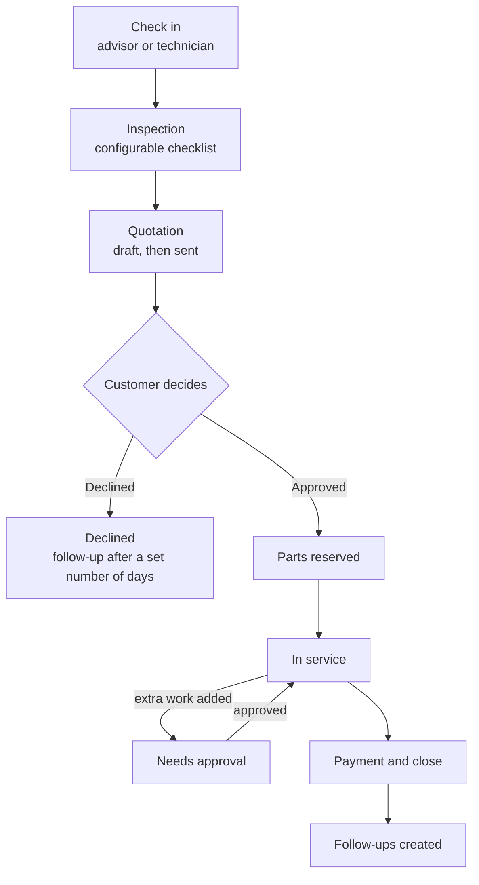
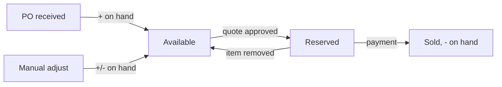

# Business processes

## 1. Work order lifecycle

### Stages

| Stage | Who works on it | What happens |
|---|---|---|
| Reception | Advisor or technician | Vehicle checked in, complaint and mileage recorded, technician assigned. A technician checking in is assigned the job by default |
| Inspection | Technician | Each point on the checklist is marked Good, Attention or Problem, with an optional note. The checklist is whatever the shop configured when the job was created |
| Quotation | Advisor, with the technician | Anyone on the job adds parts and work; only an advisor prices it, discounts it and sends it |
| In service | Technician | Work is done. Any extra work needs customer approval |
| Completed | Advisor | Payment taken, stock deducted, follow-ups created |
| Declined | — | Customer said no. A follow-up is created, and no stock is used |

### Stage gates

| From → to | Rule | Message if blocked |
|---|---|---|
| Check in | Unique phone for a new customer, unique plate for a new vehicle | Names the existing customer or plate owner |
| Check in | The vehicle has no other open job | Names the open job |
| Check in | Mileage is at least the last recorded mileage | Shows the last mileage |
| Inspection → Quotation | Every checklist point is marked | "Check all N remaining items first" |
| Quotation → Sent | At least 1 line item | "Add at least one item before sending" |
| Quotation → Sent | No line is still waiting on a price | "N items still need a price" |
| Sent → Approved or Declined | The person has the `approve` flag | Buttons hidden; forcing one is refused |
| Sent → In service | Enough available stock for every part | "Only N available for part. Raise a purchase order first." |
| In service → Payment | Work is marked done, there's no unapproved extra work, and the order has at least 1 item | Payment button hidden or blocked |

### Quote rules

- Adding or removing an item, or changing the discount, after sending returns the quote to **Draft**. The customer must see the new price before approving.
- The discount can't exceed the subtotal. Advisors are capped at 10%.
- Prices and costs are **copied onto the line** when it's added, so later price changes don't alter existing quotes or invoices.
- Totals, profit and margin are always **calculated from the lines**, never stored.
- **Raising a line from a finding links the two.** Use *Add to quote* on the finding rather than typing a line fresh: the line records which inspection point it answers, so renaming it changes nothing and the shop is never reminded to chase work it has already done.
- **Recording the customer's answer is separate from building the quote.** They are two permissions, so a shop can let one person price and another close the loop.
- A technician may add lines but never price them. A part carries the price list's price and cost without showing either; work they describe is saved unpriced and flagged until an advisor sets a price.

### The quotation document

Any role on the job can open the quote as a document. An advisor sees the
customer's version — quote number, issue and validity dates, findings written as
sentences, priced lines and the total, with no cost or margin anywhere. A
technician gets the same document as a **job sheet**: the findings, the work and
the quantities, with the money columns left out of the document rather than
hidden inside it. It prints to one page.

### Shared job notes

Every job carries a note thread that everyone working it can read and write,
technicians included. It is the channel for anything that is not a priced line —
what was found, what the customer said, what to check next. Notes are capped at
500 characters and the thread becomes read-only once the job closes.

## 1b. Stalled jobs

An open job that has not moved on is flagged on the dashboard and in Insights,
with the reason and the number of days **in its current stage** — not days since
check-in, because a job that is six days old but moved yesterday is healthy.

| Stage | What the flag says |
|---|---|
| Reception | Checked in, inspection not started |
| Inspection | Inspection started, N items still unchecked |
| Quotation | Quote sent and waiting on the customer, or built and never sent, or not started |
| In service | Work not marked done, or finished and waiting for payment |

Amber and red thresholds are set in **Settings → Timing**, so a shop decides
what "too long" means.

## 2. Stock flow

- **Available = on hand − reserved.** Quotes, approval checks and low-stock alerts all use *available*.
- Approval **reserves** parts, so two jobs can't both take the last unit.
- Payment turns the reservation into a sale: on hand goes down and reserved goes down.
- Removing an approved part during service releases its reservation.
- Stock can't be adjusted below the reserved quantity.
- Every change writes a **stock movement** (receive, sale or adjust), with a reference, a reason and the user who made it. You can see these in **Inventory → Stock history**.

## 3. Purchasing

1. Create a PO manually, use **Reorder low stock** (every part at or below its reorder level), or use **Draft purchase order** from Insights, which pre-fills the suggested quantities worked out from real usage.
2. The PO status is **Ordered**.
3. **Receive** adds the quantities to on-hand stock, writes stock movements, and sets the status to **Received**. A PO can only be received once.
4. Received orders drop off the list, since the stock they added is already in **Stock history**. A toggle brings them back.

### How the reorder suggestion is worked out

Usage comes from the sale movements of the last 90 days, giving a daily rate.
Days of cover is available stock divided by that rate. A part is suggested when
it is at or below its reorder point, or has less than three weeks of cover, and
the quantity tops it up to about 45 days. Both windows are set in
**Settings → Timing**.

## 4. Follow-ups

| Type | Created when | Due |
|---|---|---|
| `service-due` | An order is paid (next service at mileage + a configured distance) | Configurable, 180 days by default |
| `inspection-finding` | An order is paid with an Attention item, or a Problem that wasn't quoted | Configurable, 30 days by default |
| `declined-quote` | A quote is declined | Configurable, 14 days by default |
| `insurance`, `road-tax` | Entered or imported | As set |

- When a new `service-due` is created, older open `service-due` follow-ups for the same customer are closed, so there are no duplicates.
- Follow-ups are sorted by due date, and overdue ones are shown in red.
- **Book** opens check-in for that customer and closes the follow-up once the check-in succeeds.
