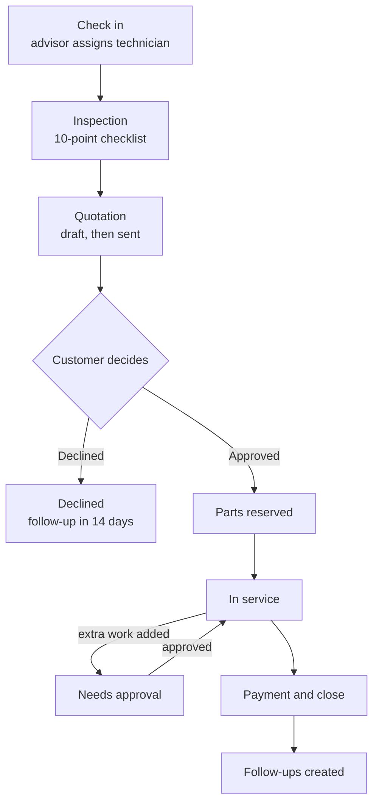
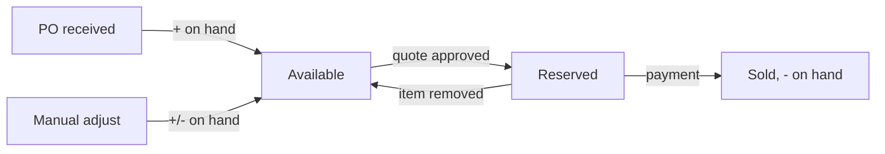

# Business processes

## 1. Work order lifecycle

### Stages

| Stage | Who works on it | What happens |
|---|---|---|
| Reception | Advisor | Vehicle checked in, complaint and mileage recorded, technician assigned |
| Inspection | Technician | Each of the 10 items is marked Good, Attention or Problem, with an optional note |
| Quotation | Advisor | Parts and labor added, discount applied, quote sent to the customer |
| In service | Technician | Work is done. Any extra work needs customer approval |
| Completed | Advisor | Payment taken, stock deducted, follow-ups created |
| Declined | — | Customer said no. A follow-up is created, and no stock is used |

### Stage gates

| From → to | Rule | Message if blocked |
|---|---|---|
| Check in | Unique phone for a new customer, unique plate for a new vehicle | Names the existing customer or plate owner |
| Check in | The vehicle has no other open job | Names the open job |
| Check in | Mileage is at least the last recorded mileage | Shows the last mileage |
| Inspection → Quotation | All 10 items are marked | "Check all N remaining items first" |
| Quotation → Sent | At least 1 line item | "Add at least one item before sending" |
| Sent → In service | Enough available stock for every part | "Only N available for part. Raise a purchase order first." |
| In service → Payment | Work is marked done, there's no unapproved extra work, and the order has at least 1 item | Payment button hidden or blocked |

### Quote rules

- Adding or removing an item, or changing the discount, after sending returns the quote to **Draft**. The customer must see the new price before approving.
- The discount can't exceed the subtotal. Advisors are capped at 10%.
- Prices and costs are **copied onto the line** when it's added, so later price changes don't alter existing quotes or invoices.
- Totals, profit and margin are always **calculated from the lines**, never stored.

## 2. Stock flow

- **Available = on hand − reserved.** Quotes, approval checks and low-stock alerts all use *available*.
- Approval **reserves** parts, so two jobs can't both take the last unit.
- Payment turns the reservation into a sale: on hand goes down and reserved goes down.
- Removing an approved part during service releases its reservation.
- Stock can't be adjusted below the reserved quantity.
- Every change writes a **stock movement** (receive, sale or adjust), with a reference, a reason and the user who made it. You can see these in **Inventory → Stock history**.

## 3. Purchasing

1. Create a PO manually, or use **Reorder low stock**, which pre-fills every part at or below its reorder level.
2. The PO status is **Ordered**.
3. **Receive** adds the quantities to on-hand stock, writes stock movements, and sets the status to **Received**. A PO can only be received once.

## 4. Follow-ups

| Type | Created when | Due |
|---|---|---|
| `service-due` | An order is paid (next service at mileage + 10,000 km) | 180 days |
| `inspection-finding` | An order is paid with an Attention item, or a Problem that wasn't quoted | 30 days |
| `declined-quote` | A quote is declined | 14 days |
| `insurance`, `road-tax` | Entered or imported | As set |

- When a new `service-due` is created, older open `service-due` follow-ups for the same customer are closed, so there are no duplicates.
- Follow-ups are sorted by due date, and overdue ones are shown in red.
- **Book** opens check-in for that customer and closes the follow-up once the check-in succeeds.
